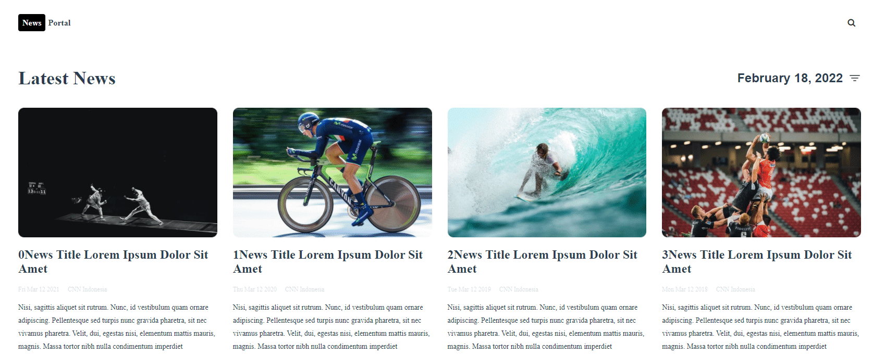

<h1 align="center">News Portal</h1>

<p align="center">
  


</p>

### Description

News portal implemented by scratch on vue.js. It has responsive design for Desktop, iPad Mini and iPhones. I made search and sort methods for news page with little animations for icons. 

<p align="center">
</p>


### CSS and libraries

- Every element is 100% css except the SVG of sort icon.
- Test animation with gsap on news list.

## Project setup

```
npm install
npm run serve
```

